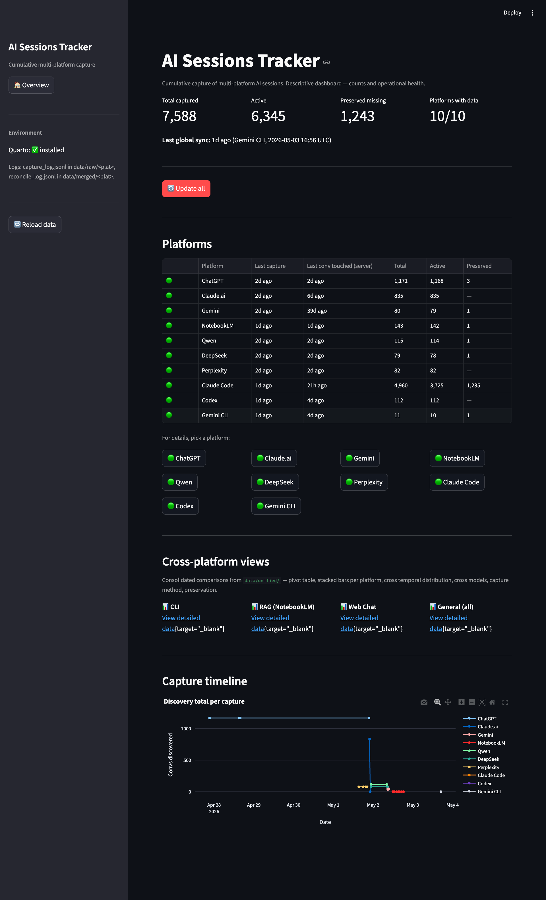
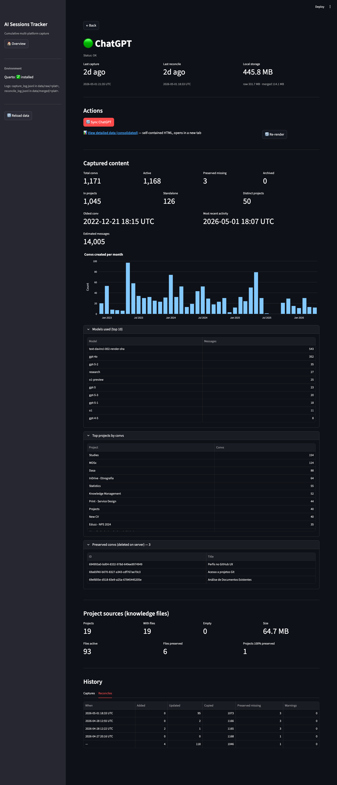
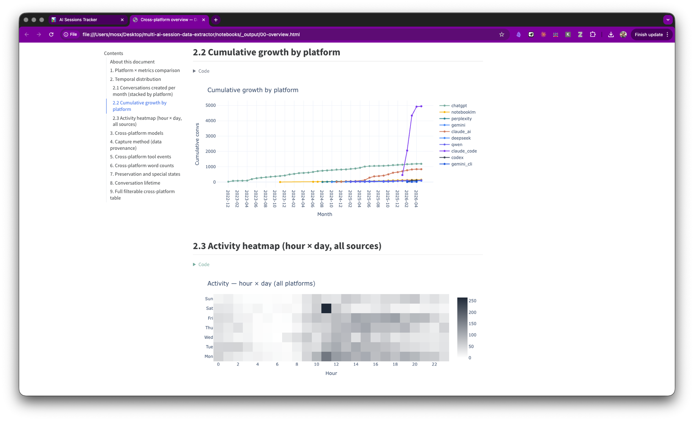

# multi-ai-session-data-extractor

[](https://github.com/mrlnlms/multi-ai-session-data-extractor/actions/workflows/test.yml)
[](https://www.python.org/downloads/)
[](LICENSE)

Capture and archive your own sessions across AI platforms
(ChatGPT, Claude.ai, Gemini, NotebookLM, Qwen, DeepSeek, Perplexity)
plus command-line tools (Claude Code, Codex, Gemini CLI).
Data is preserved locally in canonical format (parquet),
even if you delete it from the server.

> **This tool is for personal use, with your own accounts.**
> It uses the platforms' internal APIs authenticated with cookies from
> your own login (access you already have). It is not a tool for
> scraping data from other users or for bypassing terms of use —
> and should not be used that way.



## The problem

AI platforms have limited official exports, often broken, with no
guarantee of retention. You have no way of knowing whether an old
conversation will be accessible 6 months from now, or whether a new
feature will disappear taking data with it.

This project solves that by capturing everything locally:

- Conversations, projects, knowledge files, artifacts (canvas, deep research
  reports, slide decks)
- Generated images (DALL-E, Nano Banana), user uploads, mind maps
- Voice messages (transcripts), thinking blocks (reasoning), tool calls
- Chats deleted on the server — preserved locally forever

Output in **parquet** (unified schema across all 10 sources), ready
for analysis in pandas/DuckDB/Quarto/whatever you prefer.

## Current status

All 10 sources work end-to-end — capture, consolidation,
canonical parsing, and descriptive visualization (Quarto):

| Source | Type | Coverage |
|---|---|---|
| **ChatGPT** | web | branches, voice, DALL-E, projects, custom GPT |
| **Claude.ai** | web | thinking, tool use+MCP, project_docs with inline content |
| **Perplexity** | web | threads + pages + spaces + 9 artifact types |
| **Qwen** | web | 8 chat types (search, research, dalle, etc.), projects |
| **DeepSeek** | web | R1 reasoning (thinking in ~31% of msgs), token usage |
| **Gemini** | web | multi-account (2 Google accounts), 8 models |
| **NotebookLM** | web | multi-account (3), 9 output types (audio, video, slide deck, etc.) |
| **Claude Code** | CLI | local sessions (`~/.claude/projects/`), subagents |
| **Codex** | CLI | local sessions (`~/.codex/sessions/`), exact latency per tool call |
| **Gemini CLI** | CLI | local sessions (`~/.gemini/tmp/`) |

**514 tests passing.** Known limitations and gaps documented in
[docs/LIMITATIONS.md](docs/LIMITATIONS.md).

## Quickstart

Prerequisites: Python ≥3.12, macOS or Linux. Windows not tested.

```bash
git clone <repo>
cd multi-ai-session-data-extractor
python3 -m venv .venv
source .venv/bin/activate
pip install -e ".[dev]"
playwright install chromium
```

Login (once per platform — opens a browser, you log in manually, close):

```bash
python scripts/chatgpt-login.py
```

Sync (capture + consolidation + parquet in 1 command):

```bash
python scripts/chatgpt-sync.py
```

Result:

- `data/raw/ChatGPT/` — raw capture (cumulative, keeps binaries)
- `data/merged/ChatGPT/` — consolidated version (also keeps conversations
  deleted from the server)
- `data/processed/ChatGPT/*.parquet` — canonical format for analysis



Repeat the 2 commands for other platforms (`claude-login.py`,
`gemini-sync.py`, etc.). Details in [docs/SETUP.md](docs/SETUP.md).

## How it works

```
extractor → reconciler → parser → unify
   raw    →  merged    → processed (per-source) → unified (cross-source)
```

1. **Extractor** downloads via the platform's internal API (authenticated
   with your cookie).
2. **Reconciler** consolidates what you just captured with what you
   already had — preserving records that disappeared from the server.
3. **Parser** converts the raw JSON into parquet with a unified schema:
   `Conversation`, `Message`, `ToolEvent`, `Branch` (and a few auxiliaries
   per platform — `ProjectDoc`, `NotebookLMOutput`, etc.).
4. **Unify** consolidates the parquets from the 10 sources into a single
   `data/unified/` with 11 parquet files (4 canonical + 7 auxiliaries),
   ready for cross-platform analysis.

Full schema in `src/schema/models.py`. Glossary of project terms in
[docs/glossary.md](docs/glossary.md).

## Capture: visible browser or background

Login is always with a visible window (once per platform — you need to
log in manually). Capture after that varies:

| Platform | Capture |
|---|---|
| Claude.ai, Gemini, NotebookLM, Qwen, DeepSeek | No visible window |
| ChatGPT, Perplexity | Visible window (Cloudflare detects scraping without a window) |

If you run Claude.ai/Gemini/NotebookLM/Qwen/DeepSeek and see a window
open during capture: something is wrong (likely an expired cookie).
For ChatGPT/Perplexity: expected behavior.

## Commands per platform

Each platform has 2-3 scripts in `scripts/`. Pattern:

```bash
python scripts/<plat>-login.py    # once — manual login in the browser
python scripts/<plat>-sync.py     # capture + consolidation
```

Consistent flags across all syncs:

- `--full` — force full recapture (skips the incremental path)
- `--no-binaries` — skip asset downloads (images, slide decks, etc.)
- `--no-reconcile` — skip consolidation (capture only)
- `--dry-run` — show what would happen without executing

Full list of commands per platform:
[docs/operations.md](docs/operations.md).

## Dashboard

Local Streamlit visualization — cross-platform totals, per-platform
status, links to the descriptive documents:

```bash
PYTHONPATH=. streamlit run dashboard.py
```

Opens at <http://localhost:8501>. Read-only over what sync produced —
does not write or edit.

Details in [docs/dashboard/manual.md](docs/dashboard/manual.md).

## Descriptive documents (Quarto)

14 documents per platform + 4 cross-platform views — data schema,
coverage, distributions, examples. They share a single template
to avoid duplication.

```bash
QUARTO_PYTHON="$(pwd)/.venv/bin/python" quarto render notebooks/chatgpt.qmd
QUARTO_PYTHON="$(pwd)/.venv/bin/python" quarto render notebooks/00-overview.qmd
```



To view the generated HTMLs locally:

```bash
./scripts/serve-qmds.sh open
```

## Tests

```bash
PYTHONPATH=. .venv/bin/pytest                    # everything (514 tests, ~3s)
PYTHONPATH=. .venv/bin/pytest tests/parsers/     # parsers only
```

## Documentation

- [docs/README.md](docs/README.md) — full index
- [docs/SETUP.md](docs/SETUP.md) — detailed setup, first login,
  troubleshooting, optional DVC backup
- [docs/dvc-runbook.md](docs/dvc-runbook.md) — DVC operational guide
  (versioned vault for full recovery after deletion)
- [docs/LIMITATIONS.md](docs/LIMITATIONS.md) — known gaps and limitations
- [docs/operations.md](docs/operations.md) — common commands per platform
- [docs/glossary.md](docs/glossary.md) — project terms
- [docs/platforms/](docs/platforms/) — empirical behavior per platform
- [docs/SECURITY.md](docs/SECURITY.md) — credentials and ToS policy
- [docs/CONTRIBUTING.md](docs/CONTRIBUTING.md) — contributor guide

## Principles

1. **Capture once, never downgrade.** Once something is captured, it
   stays local. Reruns only fetch new items.
2. **Preservation above all.** Conversations/files deleted on the
   server remain local with the `is_preserved_missing=True` flag.
3. **The canonical schema is the boundary.** Parsers deliver parquet in
   a unified schema; analysis consumes parquet. No platform
   particularities leak into the analysis stage.
4. **Abort early in suspicious cases.** If the initial listing drops
   >20% versus history, the extractor aborts before writing
   (protection against partial captures that would contaminate the
   next run).

## License

MIT — see [LICENSE](LICENSE).

## Contributing

Issues and PRs welcome. Details in
[docs/CONTRIBUTING.md](docs/CONTRIBUTING.md), including the 8-phase
playbook for adding a new platform.
