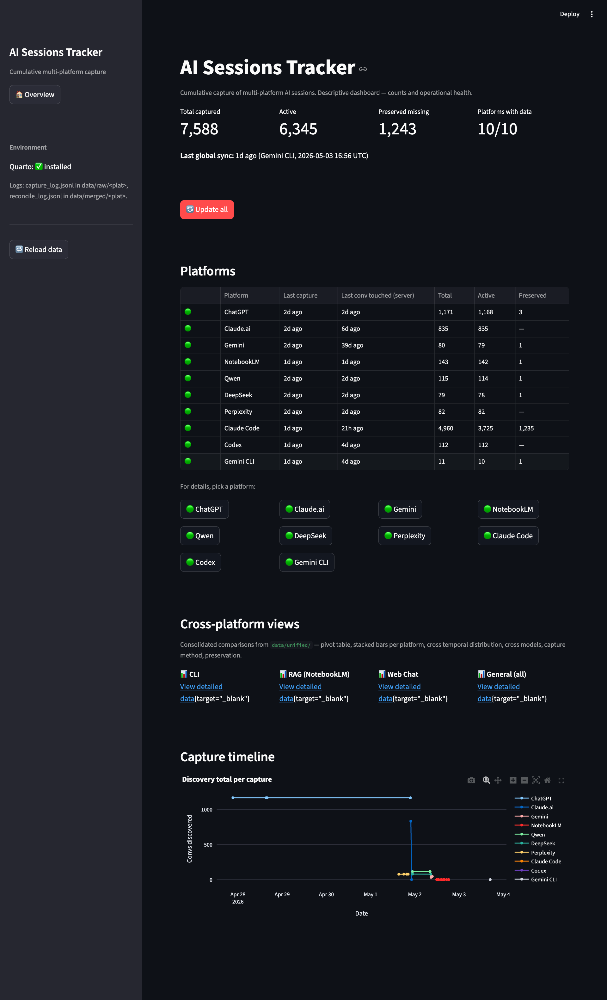
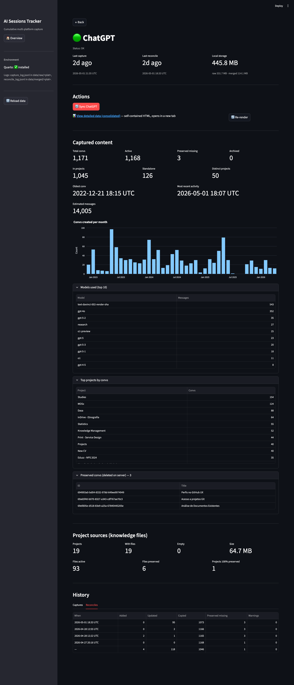
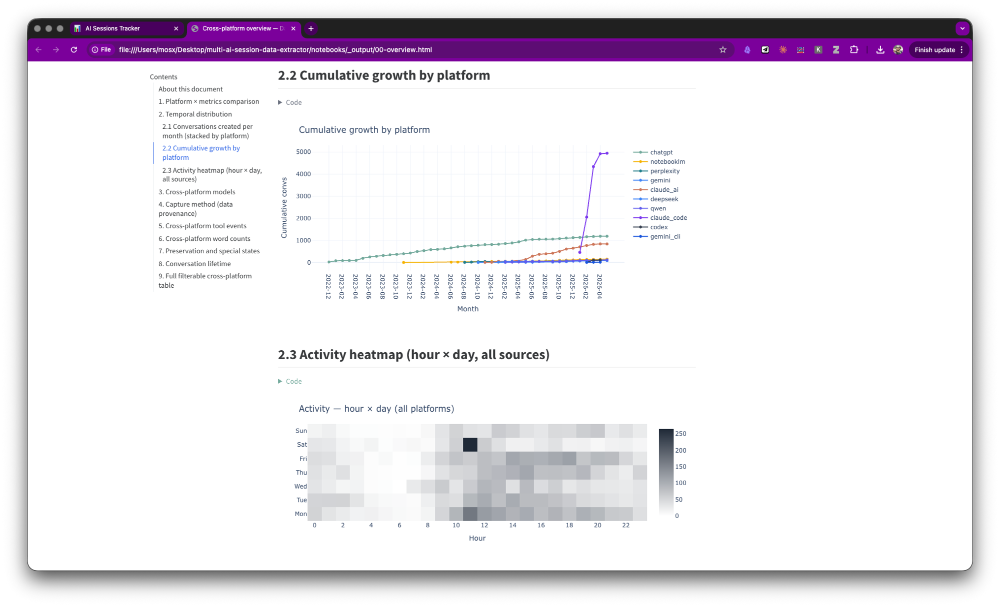

# multi-ai-session-data-extractor

[](https://www.python.org/downloads/)
[](LICENSE)

Capture, preserve, and explore your own sessions across AI platforms
(ChatGPT, Claude.ai, Gemini, NotebookLM, Qwen, DeepSeek, Perplexity,
Grok, Kimi)
plus command-line tools (Claude Code, Codex, Gemini CLI, Antigravity CLI).
Data is preserved locally in canonical format (parquet),
even if you delete it from the server.

The repository contains the code, documentation, and DVC pointers; personal
data, browser profiles, and private operating notes stay outside Git. This
makes it possible to rebuild a working machine without publishing the archive
itself.

> **This tool is for personal use, with your own accounts.**
> It uses the platforms' internal APIs authenticated with cookies from
> your own login (access you already have). It is not a tool for
> scraping data from other users or for bypassing terms of use —
> and should not be used that way.



## The problem

AI platforms have limited official exports, often broken, with no
guarantee of retention. You have no way of knowing whether an old
conversation will be accessible 6 months from now, or whether a new
feature will disappear taking data with it.

This project solves that by capturing everything locally:

- Conversations, projects, knowledge files, artifacts (canvas, deep research
  reports, slide decks)
- Generated images (DALL-E, Nano Banana), user uploads, mind maps
- Voice messages (transcripts), thinking blocks (reasoning), tool calls
- Chats deleted on the server — preserved in the local cumulative archive and
  in the published canonical base

Output in **parquet** (unified schema across all 13 sources), ready
for analysis in pandas/DuckDB/Quarto/whatever you prefer.

## Current status

All 13 sources have implemented capture/copy, consolidation where applicable,
canonical parsing, and descriptive visualization (Quarto):

| Source | Type | Coverage |
|---|---|---|
| **ChatGPT** | web | branches, voice, DALL-E, projects, custom GPT |
| **Claude.ai** | web | thinking, tool use+MCP, project_docs with inline content |
| **Perplexity** | web | threads + pages + spaces + 9 artifact types |
| **Qwen** | web | 8 chat types (search, research, dalle, etc.), projects |
| **DeepSeek** | web | R1 reasoning (thinking in ~31% of msgs), token usage |
| **Gemini** | web | multi-account, reasoning/tool events, generated assets |
| **NotebookLM** | web | multi-account, historical archives, sources and generated outputs |
| **Grok** | web | conversations, workspaces, tool events, assets, scheduled tasks |
| **Kimi** | web | chats, installed skills, tool events, signed asset downloads |
| **Claude Code** | CLI | local sessions (`~/.claude/projects/`), subagents |
| **Codex** | CLI | local sessions (`~/.codex/sessions/`), exact latency per tool call |
| **Gemini CLI** | CLI | local sessions (`~/.gemini/tmp/`) |
| **Antigravity CLI** | CLI | current trajectories plus decoded legacy `.pb` sidecars |

The automated test suite covers extractors, reconcilers, parsers, the
canonical schema, dashboard, and unification. Known limitations and gaps are
documented in [extractor engineering's known limitations](docs/extractor-engineering/known-limitations.md).

## Quickstart

Prerequisites: Python ≥3.12, macOS or Linux. Windows not tested.

```bash
git clone <repo>
cd multi-ai-session-data-extractor
python3 -m venv .venv
source .venv/bin/activate
pip install -r requirements.txt
playwright install chromium
```

Login (once per platform — opens a browser, you log in manually, close):

```bash
PYTHONPATH=. .venv/bin/python -m src.platforms.chatgpt.commands.login
```

Sync every runnable ChatGPT account, then parse the combined result once:

```bash
PYTHONPATH=. .venv/bin/python -m src.workflows.headless --plats=ChatGPT --no-publish
```

Result:

- `data/raw/ChatGPT/` — raw capture records and asset manifests (cumulative;
  asset bytes live in the central vault)
- `data/merged/ChatGPT/` — consolidated version (also keeps conversations
  deleted from the server)
- `data/processed/ChatGPT/*.parquet` — canonical format for analysis



Repeat the commands with the corresponding package under
`src/platforms/<source_id>/`. CLI sources are copied and parsed by their
respective `commands.sync` modules. Details in
[docs/SETUP.md](docs/SETUP.md).

If you are restoring an existing personal archive rather than starting a new
one, first restore your private DVC configuration and run `dvc pull`. The
[DVC runbook](docs/operations/dvc-runbook.md) explains that recovery path and the data
retention policy.

## How it works

```text
web: extractor → raw → reconciler → merged → parser ┐
CLI: cumulative copy → raw → parser                  ├→ processed → unify → unified
immutable assets → central content-addressed vault ←─┘
```

1. **Web extractors** download through each platform's internal API, using
   your authenticated local profile. The **reconciler** combines the new
   capture with previous state and preserves records that disappeared from the
   server.
2. **CLI collectors** cumulatively copy local session files into raw storage;
   they do not delete older raw material when its origin disappears.
3. **Parsers** convert the preserved source records into parquet with a unified schema:
   `Conversation`, `Message`, `ToolEvent`, `Branch` (and auxiliaries such as
   `Asset`, `AssetLink`, `ProjectDoc`, and `NotebookLMOutput`). Asset coverage
   is published under explicit web and CLI preservation scopes; the
   [source-by-source matrix](docs/extractor-engineering/asset-coverage.md)
   records relationship precision, local availability, and deliberate gaps.
   Web rows carry the immutable catalog UUID in `account_id`; the legacy
   display `account` remains available. The maintained
   [account architecture](docs/product/account-architecture.md) documents
   identity, lifecycle, local bindings, authentication observations, and
   selective sync. CLI and manual rows keep `account_id` null until a durable
   identity is observable.
4. **Unify** consolidates the parquets from the 13 sources into a single
   `data/unified/` with 16 parquet tables (4 canonical + 12 auxiliary tables,
   including the catalog-derived `accounts` dimension), ready for
   cross-platform analysis.

The published `Asset`/`AssetLink` schema and the physical storage of their
bytes are separate contracts. The central content-addressed asset vault is
materialized, verified, published through DVC, and is now the default for
normal runs. The separate retention audit was applied to `raw` and `merged`:
their redundant asset bytes were removed and now resolve through the vault,
while capture records and manifests remain in place. `legacy` remains an
explicit compatibility and diagnostic mode. See the
[asset storage transition](docs/operations/pipeline.md#transicao-do-asset-vault)
for reader selection, verification, local restore, retention, and rollback.

`data/external/` is a separate preservation boundary for manual, exported or
exceptional inputs outside regular automated capture. Some of those immutable
inputs are consumed by explicit adapters, but their acquisition is not made
reproducible by the normal sync pipeline. They are not candidates for the
raw/merged asset-retention cleanup; see [`data/external/README.md`](data/external/README.md).

Full schema in `src/schema/models.py`. Capture and parser terminology is in
[the extractor engineering glossary](docs/extractor-engineering/glossary.md).

## Capture: visible browser or background

Login is always with a visible window (once per platform — you need to
log in manually). Capture after that varies:

| Platform | Capture |
|---|---|
| Claude.ai, Gemini, NotebookLM, Qwen, DeepSeek, Grok, Kimi | No visible window |
| ChatGPT, Perplexity | Visible window (Cloudflare detects scraping without a window) |

If you run Claude.ai/Gemini/NotebookLM/Qwen/DeepSeek/Grok/Kimi and see a window
open during capture: something is wrong (likely an expired cookie).
For ChatGPT/Perplexity: expected behavior.

## Commands per platform

Each web platform keeps its operational commands together in one directory:

```bash
PYTHONPATH=. .venv/bin/python -m src.platforms.<source_id>.commands.login
PYTHONPATH=. .venv/bin/python -m src.platforms.<source_id>.commands.sync --account <key>
PYTHONPATH=. .venv/bin/python -m src.platforms.<source_id>.commands.parse
```

Common web-sync flags (availability varies by source):

- `--account KEY` — required account selected by the shared orchestrator
- `--full` — force full recapture (skips the incremental path)
- `--no-binaries` — skip asset downloads (images, slide decks, etc.)
- `--no-reconcile` — skip consolidation (capture only)
- `--dry-run` — show what would happen without executing

Full list of commands per platform:
[docs/operations/pipeline.md](docs/operations/pipeline.md).
Secondary platform helpers and probes live with their source. The
[operational command map](docs/operations/commands.md) indexes routine and
exceptional commands, including manual-save ingestion and DVC maintenance.

## Dashboard

Local Streamlit interface for cross-platform totals, per-platform status,
account operations, pipeline execution, and links to the descriptive documents:

```bash
PYTHONPATH=. .venv/bin/streamlit run dashboard/app.py
```

Opens at <http://localhost:8501>. Opening and browsing it is read-only. Account
changes, syncs, and publication are explicit, preview-first operator actions.

Details in [docs/operations/dashboard.md](docs/operations/dashboard.md).

## Descriptive documents (Quarto)

Platform and cross-platform profiles cover data schema, coverage,
distributions, and examples. They share templates to avoid duplication.

```bash
QUARTO_PYTHON="$(pwd)/.venv/bin/python" quarto render notebooks/chatgpt.qmd
QUARTO_PYTHON="$(pwd)/.venv/bin/python" quarto render notebooks/00-overview.qmd
```



To view the generated HTMLs locally:

```bash
PYTHONPATH=. .venv/bin/python -m src.workflows.serve_reports open
```

This server exposes `notebooks/_output/` directly at
<http://localhost:8765>; it is also the report endpoint used by the dashboard.
Rendered reports contain real derived data, remain ignored by Git, and are not
the source of a public GitHub Pages site.

## Tests

```bash
PYTHONPATH=. .venv/bin/pytest                    # everything
PYTHONPATH=. .venv/bin/pytest tests/parsers/     # parsers only
```

## Documentation

- [docs/README.md](docs/README.md) — full index
- [docs/ROADMAP.md](docs/ROADMAP.md) — current operational state and product horizon
- [docs/SETUP.md](docs/SETUP.md) — detailed setup, first login, and
  troubleshooting
- [docs/operations/dvc-runbook.md](docs/operations/dvc-runbook.md) — DVC operational guide
  (canonical-current data vault and local recovery)
- [docs/extractor-engineering/known-limitations.md](docs/extractor-engineering/known-limitations.md) — known extractor gaps and limitations
- [docs/operations/pipeline.md](docs/operations/pipeline.md) — common commands per platform
- [docs/product/account-architecture.md](docs/product/account-architecture.md) — account identity, lifecycle, local authentication state, and selective sync
- [docs/extractor-engineering/glossary.md](docs/extractor-engineering/glossary.md) — capture and parser terms
- [platform engineering records](docs/extractor-engineering/platforms/README.md) — empirical behavior per platform
- [docs/SECURITY.md](docs/SECURITY.md) — credentials and ToS policy
- [docs/CONTRIBUTING.md](docs/CONTRIBUTING.md) — contributor guide

## Principles

1. **Capture once, never downgrade.** Material already proven to be preserved
   is not deleted or replaced by a worse representation. Deliberate recapture
   and safe fallback may refetch known items when validation requires it.
2. **Preservation above all.** Conversations/files deleted on the
   server remain local with the `is_preserved_missing=True` flag.
   Losing or retiring an upstream account also does not remove its captured
   archive: the last raw/merged state, or an immutable external snapshot for
   an older format, remains parseable with explicit historical provenance.
3. **The canonical schema is the boundary.** Parsers deliver parquet in
   a unified schema; analysis consumes parquet. No platform
   particularities leak into the analysis stage.
4. **Fall back safely in suspicious cases.** If a discovery listing drops
   materially versus known history, the extractor must not trust it blindly;
   the applicable platform guardrail preserves or refetches known records.

Preservation can only protect material captured before access is lost. It
cannot recover records that existed only on an upstream server after the
account was deleted or became inaccessible.

## License

MIT — see [LICENSE](LICENSE).

## Contributing

Issues and PRs welcome. Details in
[docs/CONTRIBUTING.md](docs/CONTRIBUTING.md). The technical guide for a new
platform is [adding-a-platform.md](docs/extractor-engineering/adding-a-platform.md).
